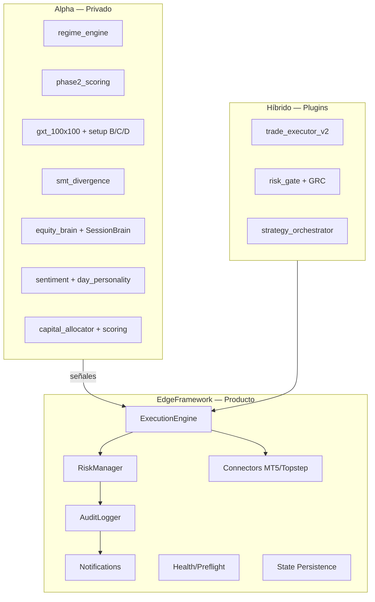

# Inventario Alpha vs SaaS — Bot5Ultra_EdgeFix_20240604

> **Proyecto origen:** `REDACTED\Bots2026\Bot5Ultra_EdgeFix_20240604`  
> **Destino SaaS:** `C:\Users\Bot5U\Desktop\EdgeFramework`  
> **Bot activo:** `bots/bot5_multi_split.py` (~7.6K líneas)  
> **Fecha inventario:** 2026-06-21

---

## Criterio de clasificación

| Clase | Definición | Destino EdgeFramework |
|-------|------------|----------------------|
| **SaaS** | Infra reutilizable: ejecución, riesgo genérico, conectores, auditoría, health, persistencia | Extraer tal cual |
| **Alpha** | Edge propietario: señales, scoring, régimen custom, inteligencia de sesión/equity | Mantener privado |
| **Híbrido** | Infra con reglas/thresholds FTMO/XAU/SMT propietarios | SaaS con plugins Alpha |
| **Ops** | Scripts, backtests, auditoría, launchers | Fuera del producto |
| **Legacy** | Existe pero no lo usa `bot5_multi_split` | Candidato a borrar/archivar |

---

## Resumen ejecutivo

| Paquete | Total | Activo | SaaS | Alpha | Híbrido | Ops/Legacy |
|---------|-------|--------|------|-------|---------|------------|
| `core/` | 90 | 42 | 18 | 12 | 12 | 48 |
| `strategies/` | 51 | 24 cargadas | 0 | 24 | 0 | 27 |
| `engine/` | 7 | 6 | 2 | 0 | 5 | 1 |
| `risk/` | 4 | 2 | 1 | 0 | 2 | 1 |
| `intelligence/` | 2 | 1 | 0 | 1 | 0 | 1 |
| `bots/` | 26 | 1 | 0 | 1 | 0 | 25 |
| Raíz + scripts | ~120 | 3 | 5 | 0 | 0 | ~112 |

**Ratio aproximado del runtime activo:** ~35% SaaS · ~45% Alpha · ~20% Híbrido

---

## 1. CORE — módulo por módulo

### Activos en `bot5_multi_split` ✅

| Módulo | Clase | Rol | EdgeFramework |
|--------|-------|-----|---------------|
| `trade_executor_v2.py` | **Híbrido** | Órdenes MT5, BE/TP/trail, retry spread | `ExecutionEngine` |
| `risk_manager.py` | **Híbrido** | DD diario/semanal, lotaje, prop rules FTMO | `RiskManager` |
| `risk_gate.py` | **Híbrido** | Pipeline unificado pre-trade (13 niveles) | `RiskManager` gate |
| `global_risk_controller.py` | **Híbrido** | GRC crisis/degradación | Plugin risk |
| `preflight.py` | **SaaS** | Checks MT5/cuenta antes de operar | `PreflightChecker` |
| `market_data_cache.py` | **SaaS** | Cache OHLC/ticks | Data layer |
| `notifier.py` | **SaaS** | Telegram público/premium | Notifications |
| `telegram_handler.py` | **SaaS** | Comandos /monitor | Notifications |
| `risk_state_reset.py` | **SaaS** | Reset diario de estado | State mgmt |
| `bot_state.py` | **SaaS** | Estado global del bot | State mgmt |
| `circuit_breaker.py` | **SaaS** | Parada de emergencia | Risk plugin |
| `position_guard.py` | **SaaS** | Cierre masivo posiciones | Execution |
| `health_check.py` | **SaaS** | Diagnóstico runtime | Health |
| `state_persistence.py` | **SaaS** | Persistencia estado | State mgmt |
| `trade_logger.py` | **SaaS** | Log de trades | `AuditLogger` |
| `trade_registry.py` | **SaaS** | Registro tickets/estrategia | Audit |
| `trade_cooldown.py` | **SaaS** | Cooldown entre trades | Anti-rebote |
| `reentry_protection.py` | **SaaS** | Guard anti-reentry | Anti-rebote |
| `new_candle_filter.py` | **SaaS** | Filtro vela nueva | Anti-rebote |
| `execution_manager.py` | **SaaS** | Capa ejecución config-driven | Execution |
| `performance_tracker.py` | **SaaS** | Ventana rolling PF/WR | Metrics |
| `metrics_tracker.py` | **SaaS** | Métricas live | Metrics |
| `metrics_writer.py` | **SaaS** | Escritura JSONL | Metrics |
| `forward_monitor.py` | **SaaS** | Monitor forward-test | Metrics |
| `dashboard_connector.py` | **SaaS** | Bridge dashboard | API |
| `silent_logger.py` | **SaaS** | Log errores silenciados | Observability |
| `flash_crash_detector.py` | **Híbrido** | Detección flash crash (thresholds custom) | Risk plugin |
| `addon_memory.py` | **Alpha** | Memoria addon/pyramiding | Alpha only |
| `loss_logger.py` | **Alpha** | Aprendizaje de pérdidas | Alpha only |
| `regime_engine.py` | **Alpha** | Régimen + mapa estrategia/símbolo | Alpha only |
| `phase2_scoring.py` | **Alpha** | Scoring fase 2 propietario | Alpha only |
| `strategy_scoring.py` | **Alpha** | Scoring estrategias (core) | Alpha only |
| `strategy_orchestrator.py` | **Híbrido** | Orquestación PF/Sharpe/WR | SaaS + thresholds Alpha |
| `equity_brain.py` | **Alpha** | Gestión equity adaptativa | Alpha only |
| `sentiment_engine.py` | **Alpha** | Sentimiento de mercado | Alpha only |
| `day_personality.py` | **Alpha** | Personalidad del día | Alpha only |
| `giveback_engine.py` | **Alpha** | Clasificación giveback | Alpha only |
| `session_transitions.py` | **Alpha** | Analytics transiciones sesión | Alpha only |
| `adaptation_tracker.py` | **Alpha** | Tracking adaptaciones | Alpha only |
| `false_defensive.py` | **Alpha** | Detección defensiva falsa | Alpha only |
| `equity_stability.py` | **Alpha** | Estabilidad equity | Alpha only |
| `daily_metrics.py` | **Alpha** | Métricas diarias + SessionBrain | Alpha only |
| `adaptive_params.py` | **Alpha** | Parámetros adaptativos | Alpha only |
| `smart_trade_manager.py` | **Híbrido** | BE/trail inteligente | Execution plugin |
| `signal_validator.py` | **Híbrido** | Validación señal pre-ejecución | Gate plugin |
| `signal_funnel_audit.py` | **Alpha** | Auditoría embudo señales | Alpha analytics |
| `trade_context_logger.py` | **Alpha** | Contexto completo del trade | Alpha analytics |
| `trade_intelligence_analyzer.py` | **Alpha** | Análisis post-trade IA | Alpha analytics |
| `audit_portfolio.py` | **Alpha** | Auditoría portfolio | Alpha analytics |

### Inline en `bot5_multi_split.py` (no es archivo separado)

| Componente | Clase | Activo |
|------------|-------|--------|
| `SessionBrain` (clase ~L479) | **Alpha** | ✅ Modifica riesgo/score por sesión, bloquea NY |

### Core — Legacy / no activo

| Módulo | Clase | Notas |
|--------|-------|-------|
| `trade_executor.py` | Legacy | Reemplazado por v2 |
| `strategy_router.py` / `_backup` | Legacy | Router viejo |
| `strategy_loader.py` | Legacy | |
| `capital_allocator.py` (core) | Legacy | Usa `engine.capital_allocator` |
| `market_regime.py` | Legacy | Usa `engine.market_regime_detector` |
| `mean_reversion.py` (core) | Legacy | Duplicado en strategies |
| `liquidity_sweep.py` (core) | Legacy | Duplicado en strategies |
| `adaptive_exit.py` | Legacy | |
| `trailing.py` / `trailing_manager.py` | Legacy | Lógica en trade_executor_v2 |
| `trade_closer.py` | Legacy | |
| `trade_limiter.py` | Legacy | |
| `pyramiding_monitor.py` | Legacy | |
| `replikanto_sender.py` | Legacy | |
| `leobot_publisher.py` | Legacy | |
| `edge_trace.py` | Legacy | |
| `live_metrics.py` | Ops | |
| `watchdog.py` | Legacy | health_check lo cubre |
| `mt5_safe.py` / `mt5_test.py` | Ops | |
| `preflight.backup*` / `preflightRespaldo.py` | Legacy | Backups |
| `bot5_integration.py` | Legacy | |
| `batch_manager.py` | Legacy | |
| `config_validator.py` | Ops | |
| `daily_analyzer.py` | Ops | |
| `data_handler.py` | Legacy | |
| `indicators.py` | Legacy | strategies tiene el suyo |
| `signal_generator.py` (core) | Legacy | |
| `signals/ema_rsi_scalp.py` | Legacy | |
| `session_guard.py` / `session_utils.py` | Legacy | SessionBrain lo reemplaza |
| `market_feed_audit.py` | Ops | |
| `metrics_logger.py` / `telemetry.py` | Ops | |
| `state.py` | Legacy | |
| `utils.py` / `atr_utils.py` / `trading_hours.py` | SaaS | Utilidades — extraer si se necesitan |
| `logger.py` | SaaS | |

---

## 2. ENGINE — activo vía `_init_subsystems()`

| Módulo | Clase | Activo | EdgeFramework |
|--------|-------|--------|---------------|
| `market_regime_detector.py` | **Híbrido** | ✅ | Regime plugin |
| `volatility_engine.py` | **Híbrido** | ✅ | Volatility plugin |
| `strategy_selector.py` | **Híbrido** | ✅ | Strategy router |
| `strategy_scoring_engine.py` | **Alpha** | ✅ | Alpha scoring |
| `capital_allocator.py` | **Alpha** | ✅ | Alpha allocation |
| `strategy_correlation_filter.py` | **SaaS** | ✅ | Portfolio filter |
| `__init__.py` | — | — | — |

---

## 3. RISK — activo

| Módulo | Clase | Activo | EdgeFramework |
|--------|-------|--------|---------------|
| `drawdown_controller.py` | **Híbrido** | ✅ | `RiskManager` DD |
| `portfolio_risk_engine.py` | **Híbrido** | ✅ | Portfolio risk |
| `position_sizing_model.py` | **SaaS** | ❌ | Sizing genérico |
| `__init__.py` | — | — | — |

---

## 4. INTELLIGENCE

| Módulo | Clase | Activo |
|--------|-------|--------|
| `portfolio_engine.py` | **Alpha** | ✅ |
| `__init__.py` | — | — |

---

## 5. STRATEGIES — todas Alpha

### Cargadas dinámicamente (`AVAILABLE_STRATEGIES`) — 24 módulos

| Estrategia | En `SYMBOL_STRATEGY_MAP` | Producción |
|------------|--------------------------|------------|
| `gxt_100x100` | ✅ 4 símbolos | **Principal** |
| `setup_b_bos` | ✅ | **Principal** |
| `setup_c_ob` | ✅ | **Principal** |
| `setup_d_sweep` | ✅ | **Principal** |
| `smt_divergence` | ✅ | **Principal** (+ bias/PSP directo) |
| `xau_trend_following` | ✅ XAUUSD | Activa |
| `trend_momentum` | ✅ | Activa |
| `momentum_break` | ✅ | Activa |
| `choch_detector` | ✅ | Activa |
| `liquidity_sweep` | ✅ | Activa |
| `smc_core` | ✅ XAUUSD | Activa |
| `mean_reversion` | Sesión/régimen | Secundaria |
| `volatility_breakout` | Blacklist | Secundaria |
| `smc_fvg` | Blacklist only | Fallback/config |
| `smc_expansion` | — | Cargada, no en mapa |
| `hybrid_trending/ranging/volatility` | — | Legacy router |
| `xau_scalping` / `forex_scalping` | — | Legacy |
| `ema_rsi_strategy` | — | Legacy |
| `breakout_momentum` | — | Legacy |
| `impulso_bajista` | — | Legacy |
| `addon_pyramiding` | — | Addon |
| `silver_bullet_fvg` | — | Legacy |
| `simple_ema_strategy` | — | Demo/ejemplo |

### `SYMBOL_STRATEGY_MAP` (producción)

```python
SYMBOL_STRATEGY_MAP = {
    "XAUUSD":     ["gxt_100x100", "setup_b_bos", "setup_c_ob", "setup_d_sweep",
                   "smt_divergence", "xau_trend_following", "trend_momentum",
                   "momentum_break", "choch_detector", "liquidity_sweep", "smc_core"],
    "XAGUSD":     ["gxt_100x100", "setup_b_bos", "setup_c_ob", "setup_d_sweep",
                   "smt_divergence", "trend_momentum", "liquidity_sweep"],
    "US100.cash": ["gxt_100x100", "setup_b_bos", "setup_c_ob", "setup_d_sweep",
                   "smt_divergence", "trend_momentum", "momentum_break",
                   "choch_detector", "liquidity_sweep"],
    "US30.cash":  ["gxt_100x100", "setup_b_bos", "setup_c_ob", "setup_d_sweep",
                   "smt_divergence", "trend_momentum", "momentum_break",
                   "choch_detector", "liquidity_sweep"],
}
```

### No cargadas — Legacy/Ops (27 archivos)

`atr_volatility`, `breakout`, `breakout_strategy`, `ema_*`, `fib_786_entry`, `liquidity_smt*`, `mnq_bot`, `ny_breakout`, `patterns`, `run_*`, `smc_fvg_backup/pro/lite`, `strategy_router`, `structure`, `trend_pullback`, `xauusd_trend_break_pullback_h1`, `xau_scalping_debug`, `indicators.py`

---

## 6. BOTS — solo uno es producción

| Bot | Clase | Estado |
|-----|-------|--------|
| **`bot5_multi_split.py`** | **Alpha+SaaS** | ✅ **PRODUCCIÓN** |
| `bot5_multi_split_HARDENED.py` | Backup | Legacy |
| `bot5_multi_split_backup.py` / `.backup.fase12.py` | Backup | Legacy |
| `bot5_xauusd_split.py` / `bot5_cycle_*` / `bot5_loop_*` | Variantes | Legacy |
| `bot1-4_*`, `main_bot.py`, `strategy_bot.py` | Arquitectura vieja | Legacy |
| `api_server.py` | SaaS | Ops (dashboard) |
| `xau_scalper/asia/main.py` | Alpha | Sub-bot aislado |

---

## 7. Raíz, dashboard, scripts — Ops (no Alpha ni SaaS core)

| Área | Ejemplos | Clase |
|------|----------|-------|
| Launchers | `bot5_launcher.py`, `bot5_api_server.py` | Ops |
| Monitores | `monitor_bot.py`, `watchdog.py`, `ws_server.py` | Ops |
| Backtesting | `backtesting/*`, `backtest_bot5*.py` | Ops |
| Scripts | `scripts/*` (~50 archivos) | Ops |
| Audit kit | `bot_audit_kit/*`, `Tools/*` | Ops |
| Mejoras pendientes | `mejoras_pendientes/*` | WIP/staging |
| Dashboard | `dashboard/server.py` | SaaS (UI) |

---

## 8. Mapa Alpha → EdgeFramework (migración)



---

## 9. Imports activos confirmados (`bot5_multi_split.py`)

### Top-level (siempre)

```
core.risk_state_reset
core.market_data_cache
core.trade_executor_v2
core.notifier
core.risk_gate
core.bot_state
core.risk_manager
```

### Try/import condicional (42 módulos core + 6 engine + 2 risk + 1 intelligence)

Todos listados en sección 1 como ✅.

### Estrategias dinámicas

```python
mod = __import__(f"strategies.{name}", fromlist=["generate_signal"])
# 24 estrategias en AVAILABLE_STRATEGIES
```

### SMT directo (además del import dinámico)

```
strategies.smt_divergence → generate_signal, get_smt_bias, check_psp_candles
```

### Engine / Risk / Intelligence (vía `_init_subsystems()`)

```
engine.market_regime_detector
engine.volatility_engine
engine.strategy_selector
engine.strategy_scoring_engine
engine.capital_allocator
engine.strategy_correlation_filter
intelligence.portfolio_engine
risk.drawdown_controller
risk.portfolio_risk_engine
```

---

## 10. Recomendación de extracción

| Prioridad | Extraer a EdgeFramework | Mantener Alpha |
|-----------|------------------------|----------------|
| P0 | `trade_executor_v2`, `risk_manager`, `risk_gate`, `preflight`, `notifier`, `market_data_cache`, `health_check` | — |
| P1 | `trade_logger`, `state_persistence`, `circuit_breaker`, anti-rebote (cooldown/reentry/candle) | `regime_engine`, `phase2_scoring` |
| P2 | `strategy_correlation_filter`, `metrics_*` | `gxt_100x100`, `setup_*`, `smt_divergence`, `equity_brain`, `SessionBrain` |
| P3 | Dashboard/API | `sentiment_engine`, `day_personality`, `trade_intelligence_analyzer` |

### Candidatos a archivar (~60 archivos)

- Backups en `core/` (`preflight.backup*`, `strategy_router_backup`)
- `strategies/smc_fvg_*` (backup/pro/lite)
- Bots legacy (`bot1-4_*`, `bot5_cycle_*`, etc.)
- `trade_executor.py` v1
- `mejoras_pendientes/` una vez integradas

---

## 11. Correspondencia EdgeFramework existente

| EdgeFix (SaaS) | EdgeFramework actual | Estado |
|----------------|---------------------|--------|
| `trade_executor_v2` | `edge_framework/engine.py` | ✅ Parcial |
| `risk_manager` + `risk_gate` | `risk/manager.py` | ✅ Parcial |
| `trade_logger` / audit | `audit/logger.py` | ✅ |
| MT5 connector | `connectors/mt5.py` | ✅ |
| Topstep connector | `connectors/topstep.py` | ✅ |
| Paper connector | `connectors/paper.py` | ✅ |
| Main loop | `core/loop.py` | ✅ |
| `preflight` | — | ❌ Pendiente |
| `notifier` / Telegram | — | ❌ Pendiente |
| `market_data_cache` | — | ❌ Pendiente |
| `health_check` | — | ❌ Pendiente |
| Anti-rebote (cooldown/reentry) | — | ❌ Pendiente |

---

*Generado desde inventario de sesión 2026-06-21. Origen: Bot5Ultra_EdgeFix_20240604.*